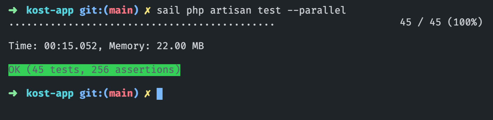

# Kost App
A simple RESTful API for a room marketplace

## Getting Started
### Server Prerequisites
- PHP 8.1
- Composer
- MySQL 8.0 database
- SQlite (for automated testing)

### Installation
#### Clone this project

``` sh
git clone git@github.com:kemalnw/kost-app.git
```
then, change active directory to the project
``` sh
cd kost-app
```
#### Installing all dependencies
``` sh
composer install
```

### Database
Create new MySQL database for this application
``` sh
mysqladmin -urootuser -p create kost_app
```
### Configuration
#### Copying the .env file
``` sh
cp .env.example .env
```
And then, change it according to your credentials
#### Generate Application Key
``` sh
php artisan key:generate
```
### Run The Database Migration
``` sh
php artisan migrate
```
## Running The Scheduler
This project using built-in Laravel task scheduler to recharge the user credit. So, you need to add a single cron configuration entry to the server that runs the `schedule:run` command every minute
```
* * * * * cd /path-to-the-project && php artisan schedule:run >> /dev/null 2>&1
```

## Documentation
You'll find the documentation using Open API spec through this [file](opeapi.yaml). You might need to using tool like [swagger](https://editor.swagger.io) to understand the spec.

## Testing
``` sh
php artisan test --parallel
```


## Local Development Server
If you have PHP installed locally and you would like to use PHP's built-in development server to serve your application, you may use the serve Artisan command.
``` sh
php artisan serve
```
